# 🎬 CineMax

Sistema web de reserva de entradas de cine construido como monorepo full-stack. Simula la experiencia completa de un cine real: cartelera, selección de asientos, snacks, pago y un panel administrativo funcional.

Proyecto de portafolio — pensado para demostrar arquitectura full-stack (NestJS + React), modelado de datos relacional y un flujo de UX de comercio electrónico de principio a fin.

<p align="center">
  
</p>

## Tabla de contenidos

- [Vista previa](#vista-previa)
- [Tecnologías](#tecnologías)
- [Funcionalidades](#funcionalidades)
- [Requisitos](#requisitos)
- [Instalación y arranque](#instalación-y-arranque)
- [Usuarios de prueba](#usuarios-de-prueba)
- [Scripts disponibles](#scripts-disponibles)
- [API Endpoints](#api-endpoints-principales)
- [Estructura del proyecto](#estructura-del-proyecto)
- [Consideraciones importantes](#consideraciones-importantes)
- [Licencia](#licencia)

## Vista previa

### Home y cartelera

| Destacadas | Cartelera con funciones |
|---|---|
| 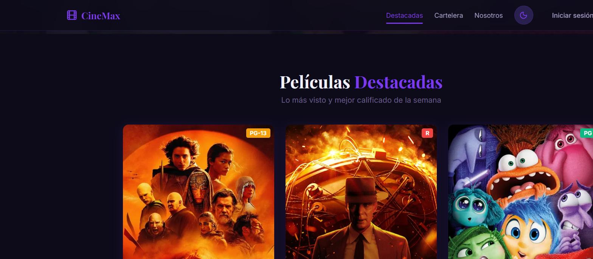 | 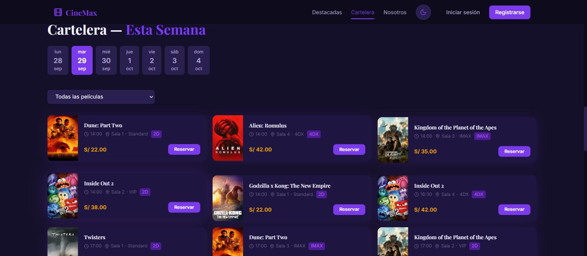 |

Sección de "Próximas funciones" filtrable por día de la semana, con horario, sala, formato (2D / IMAX / 4DX) y precio.

### Detalle de película

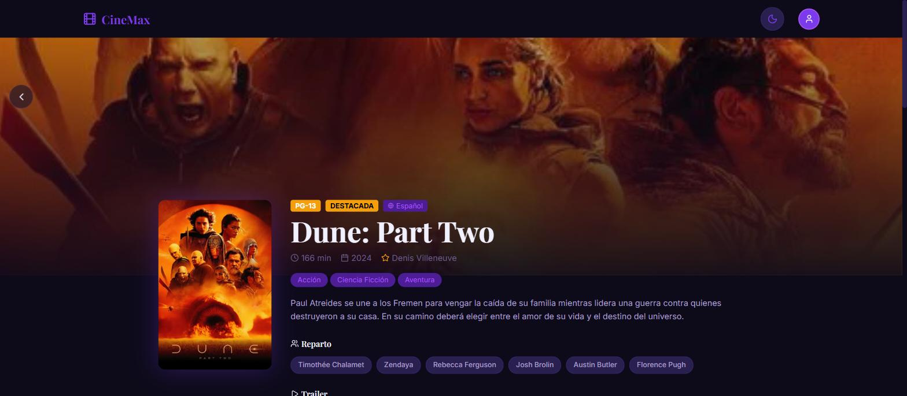

Ficha con sinopsis, reparto, trailer embebido de YouTube y funciones disponibles agrupadas por fecha.

### Flujo de reserva (3 pasos)

| 1. Selección de asientos | 2. Bocadillos | 3. Confirmación y pago |
|---|---|---|
| 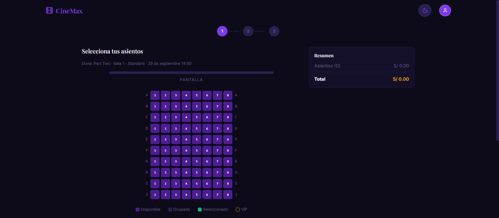 | 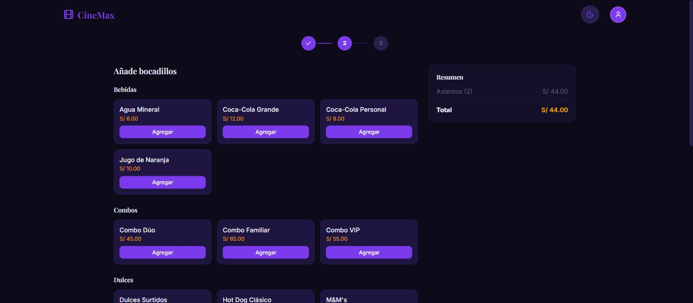 | 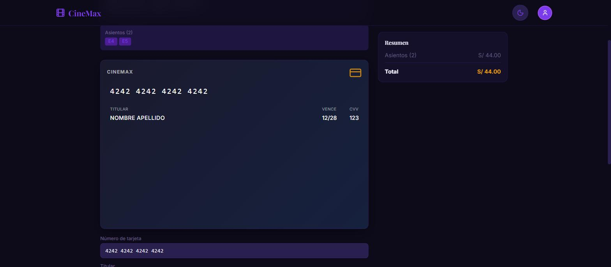 |

Mapa de asientos interactivo en tiempo real (disponible / ocupado / seleccionado / VIP), carrito de snacks por categoría y resumen de compra con formulario de pago (simulado).

<p align="center">
  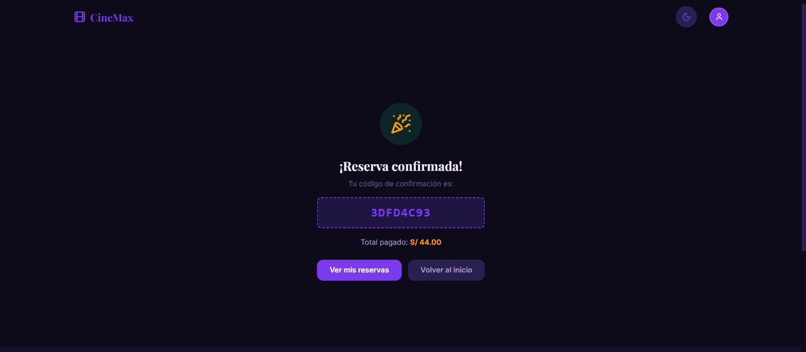
</p>

### Cuenta de usuario

| Login | Mis reservas |
|---|---|
| 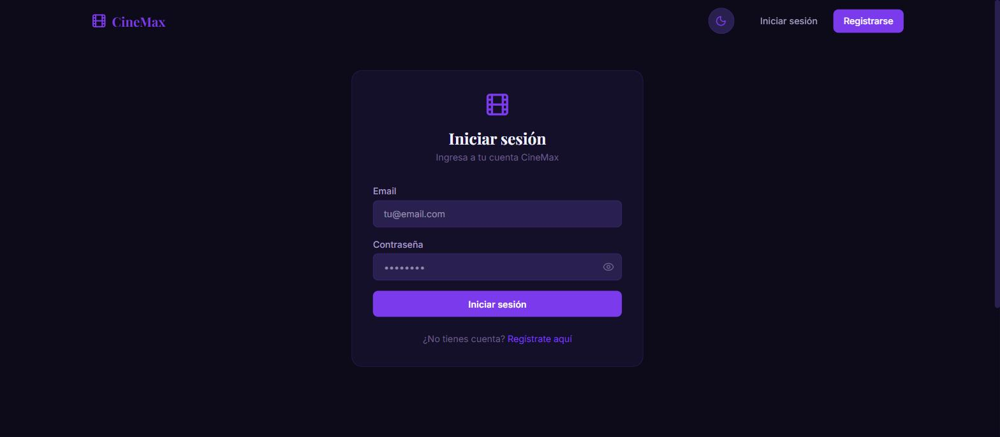 | 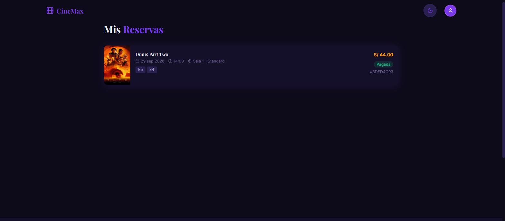 |

### Panel administrativo

| Dashboard | Gestión de películas |
|---|---|
| 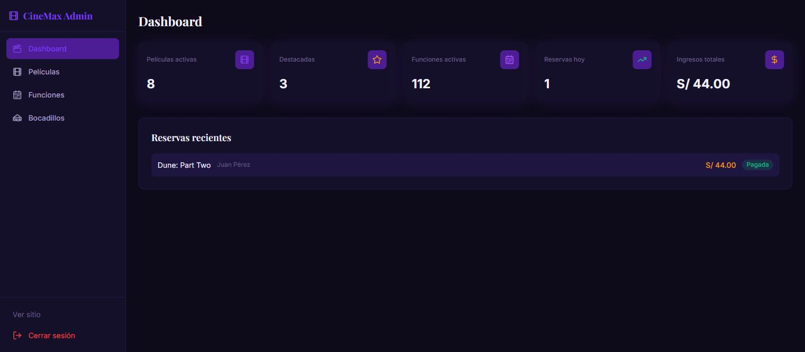 | 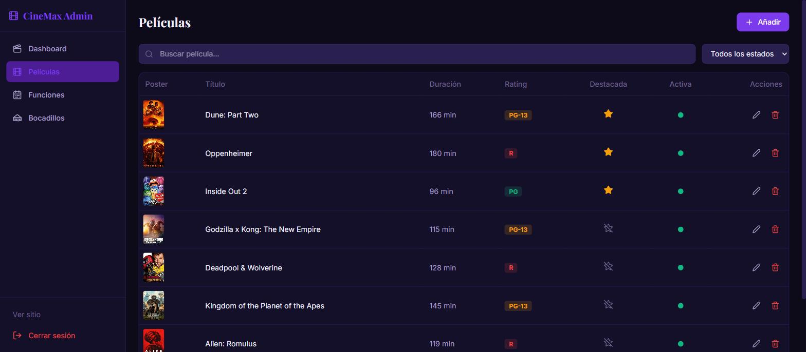 |

El dashboard muestra métricas en vivo (películas activas, funciones activas, reservas del día, ingresos) y las últimas reservas registradas. El CRUD de películas, funciones y bocadillos es completo (crear, editar, activar/desactivar, eliminar).

## Tecnologías

| Capa | Tecnología |
|---|---|
| Frontend | React 19 + TypeScript + Vite 8 (Rolldown) |
| Backend | NestJS 10 + TypeORM |
| Base de datos | PostgreSQL 16 (Docker) |
| Autenticación | JWT en cookie httpOnly |
| UI | Tailwind CSS 4 + Framer Motion + Radix UI |
| Estado / datos | Zustand + TanStack Query |

## Funcionalidades

- Catálogo de películas con pósters desde TMDB y películas destacadas
- Cartelera semanal filtrable por día y por película
- Selección de asientos interactiva por sala (estándar, VIP, IMAX, 4DX)
- Carrito de snacks con categorías (bebidas, combos, dulces, etc.)
- Flujo de reserva de 3 pasos con resumen de precio en vivo
- Autenticación de usuarios (registro / inicio de sesión) con JWT en cookie httpOnly
- Historial de reservas por usuario ("Mis reservas")
- Panel administrativo con dashboard de métricas y CRUD de películas, funciones, salas, bocadillos y usuarios
- Roles de usuario (`user` y `admin`)
- Tema claro / oscuro
- Prevención de doble reserva del mismo asiento (trigger en base de datos)

## Requisitos

- **Node.js 20.19+ o 22.12+** (Vite 8 + TypeScript 6 lo exigen; "Node 18+" ya no es suficiente)
- **Docker Desktop** (con Docker Compose v2 integrado — el comando es `docker compose`, sin guion, en instalaciones recientes)
- npm

## Instalación y arranque

```bash
# 1. Clonar el repositorio
git clone <url-del-repositorio>
cd CinemaApp/Cinema        # el proyecto vive dentro de la carpeta Cinema

# 2. Instalar dependencias (cliente + servidor)
npm run setup

# 3. Levantar PostgreSQL con Docker
npm run db:start

# 4. Iniciar frontend y backend en modo desarrollo
npm run dev
```

No hace falta crear `server/.env` manualmente: el repositorio ya incluye uno completo con la configuración de base de datos, `JWT_SECRET`, `PORT=3001` y `FRONTEND_URL`. Solo edítalo si necesitas cambiar algún valor (por ejemplo, el puerto de PostgreSQL si el `5432` local ya está en uso por otro contenedor).

La aplicación estará disponible en:
- Frontend: `http://localhost:5173` (Vite usa el siguiente puerto libre, p. ej. `5174`, si el `5173` está ocupado)
- Backend API: `http://localhost:3001`

> **Nota sobre el seed:** `server/db/init.sql` solo se ejecuta la primera vez que se crea el volumen de Docker (`pgdata`). Las funciones de cine (`screenings`) se generan para los **7 días siguientes al momento del seed**, así que si el proyecto lleva un tiempo sin levantarse, la cartelera puede aparecer vacía. En ese caso, ejecuta `npm run db:reset` para regenerar el volumen y las funciones con fechas vigentes (esto borra los datos actuales de la base).

### Otros comandos útiles

```bash
npm run db:stop          # Detiene el contenedor de PostgreSQL
npm run db:reset         # Reinicia la base de datos desde cero (docker-compose down -v && up -d)
npm run dev:server       # Solo backend
npm run dev:client       # Solo frontend
npm run build            # Build de producción del frontend
```

## Usuarios de prueba

| Rol | Email | Contraseña |
|---|---|---|
| Admin | `admin@cinemax.pe` | `Admin123!` |
| Usuario | `juan.perez@gmail.com` | `User123!` |
| Usuario | `maria.garcia@gmail.com` | `User123!` |

## Scripts disponibles

| Script | Descripción |
|---|---|
| `npm run dev` | Inicia frontend y backend simultáneamente |
| `npm run dev:server` | Inicia solo el backend |
| `npm run dev:client` | Inicia solo el frontend |
| `npm run build` | Compila el frontend para producción |
| `npm run db:start` | Levanta PostgreSQL con Docker (`docker-compose up -d`) |
| `npm run db:stop` | Detiene PostgreSQL |
| `npm run db:reset` | Reinicia la base de datos desde cero |
| `npm run setup` | Instala dependencias de cliente y servidor |

## API Endpoints principales

### Autenticación
- `POST /api/auth/register` — Registro de usuario
- `POST /api/auth/login` — Inicio de sesión
- `POST /api/auth/logout` — Cerrar sesión
- `GET /api/auth/me` — Perfil del usuario autenticado
- `PUT /api/auth/me` — Actualizar perfil

### Películas
- `GET /api/movies` — Listar películas (`?all=true` incluye inactivas)
- `GET /api/movies/featured` — Películas destacadas
- `GET /api/movies/:id` — Detalle de película
- `POST /api/movies` — Crear película (admin)
- `PUT /api/movies/:id` — Actualizar película (admin)
- `DELETE /api/movies/:id` — Eliminar película (admin)
- `PATCH /api/movies/:id/featured` — Alternar destacado (admin)

### Funciones
- `GET /api/screenings` — Listar funciones (`?all=true` incluye inactivas)
- `GET /api/screenings/by-movie/:movieId` — Funciones por película
- `GET /api/screenings/:id` — Detalle de función
- `GET /api/screenings/:id/seats` — Asientos de una función
- `POST /api/screenings` — Crear función (admin)
- `PUT /api/screenings/:id` — Actualizar función (admin)
- `DELETE /api/screenings/:id` — Desactivar función (admin)

### Reservas
- `POST /api/reservations` — Crear reserva
- `GET /api/reservations/my` — Mis reservas
- `GET /api/reservations/:id` — Detalle de reserva
- `POST /api/reservations/:id/simulate-payment` — Simular pago
- `POST /api/reservations/:id/cancel` — Cancelar reserva
- `GET /api/reservations` — Todas las reservas (admin)

### Bocadillos
- `GET /api/snacks` — Listar bocadillos (`?all=true` incluye no disponibles)
- `GET /api/snacks/:id` — Detalle de bocadillo
- `POST /api/snacks` — Crear bocadillo (admin)
- `PUT /api/snacks/:id` — Actualizar bocadillo (admin)
- `DELETE /api/snacks/:id` — Eliminar bocadillo (admin)
- `PATCH /api/snacks/:id/availability` — Alternar disponibilidad (admin)

### Usuarios (admin)
- `GET /api/users` — Listar usuarios (paginado)
- `PUT /api/users/:id/role` — Cambiar rol de usuario

### Salas
- `GET /api/rooms` — Listar salas
- `GET /api/rooms/:id` — Detalle de sala

## Estructura del proyecto

```
CinemaApp/
├── README.md
├── screenshots/         # Capturas usadas en este README
└── Cinema/               # Proyecto real (cd aquí para trabajar)
    ├── client/           # Frontend React + Vite
    │   ├── src/
    │   │   ├── api/         # Cliente HTTP y endpoints
    │   │   ├── components/  # Componentes UI
    │   │   ├── pages/       # Páginas (admin, booking, etc.)
    │   │   ├── store/       # Zustand stores
    │   │   ├── hooks/       # Custom hooks
    │   │   ├── types/       # Tipos TypeScript
    │   │   └── styles/      # CSS tokens y estilos
    │   └── .env
    ├── server/           # Backend NestJS
    │   ├── src/
    │   │   ├── auth/        # Módulo de autenticación
    │   │   ├── movies/      # Módulo de películas
    │   │   ├── screenings/  # Módulo de funciones
    │   │   ├── reservations/# Módulo de reservas
    │   │   ├── snacks/      # Módulo de bocadillos
    │   │   ├── rooms/       # Módulo de salas
    │   │   ├── users/       # Módulo de usuarios
    │   │   ├── entities/    # Entidades TypeORM
    │   │   └── common/      # Decoradores y filtros compartidos
    │   ├── db/
    │   │   └── init.sql     # Schema y seed data
    │   └── .env
    ├── docker-compose.yml
    └── package.json
```

## Consideraciones importantes

### Pagos
Los pagos **no están implementados**. Es un proyecto de muestra. Existe un endpoint `POST /api/reservations/:id/simulate-payment` que marca la reserva como `paid` sin procesar ningún pago real; el formulario de tarjeta del checkout es puramente visual.

### Stack tecnológico
- **Backend**: NestJS con TypeORM y PostgreSQL (`synchronize: false` — el schema lo crea `server/db/init.sql`, no TypeORM). Cada controlador define su propio prefijo `api/...` (no hay `setGlobalPrefix` en `main.ts`). Las imágenes de las entidades se guardan como URLs (no archivos locales).
- **Frontend**: React 19 con Vite. `axios` con `withCredentials: true` para cookies. El cliente llama a `/api` con `baseURL` vacío y Vite hace proxy a `localhost:3001`, por eso `client/.env` no necesita `VITE_API_URL`. El build actual usa Rolldown (bundler de Vite 8).
- **Autenticación**: JWT almacenado en cookie httpOnly, no en localStorage. La sesión se puede invalidar desde el backend (token version).
- **Seed data**: La base de datos se inicializa automáticamente mediante `server/db/init.sql` al crear el volumen de Docker por primera vez (ver nota sobre `db:reset` más arriba).

### Recursos de imágenes
- **Películas**: Pósters obtenidos de TMDB (`image.tmdb.org`). Si una URL falla, se muestra un placeholder de `placehold.co`.
- **Bocadillos**: Imágenes placeholder de `placehold.co` con el nombre del producto, ya que no existe un recurso equivalente a TMDB para imágenes de comida. Se incluye fallback `onError` con la inicial del producto.
- **Usuarios**: Sin avatar por defecto.

### Seguridad
- Las contraseñas se almacenan hasheadas con `bcrypt`.
- El JWT expira en 1 hora y se envía como cookie httpOnly.
- `helmet` activado para cabeceras de seguridad.
- Prevención de doble reserva del mismo asiento mediante trigger en base de datos.
- El archivo `server/.env` contiene las credenciales de la base de datos y la clave JWT. Para un despliegue real, estos valores deben cambiarse.

## Licencia

Proyecto educativo y de portafolio. Sin licencia de uso comercial.
